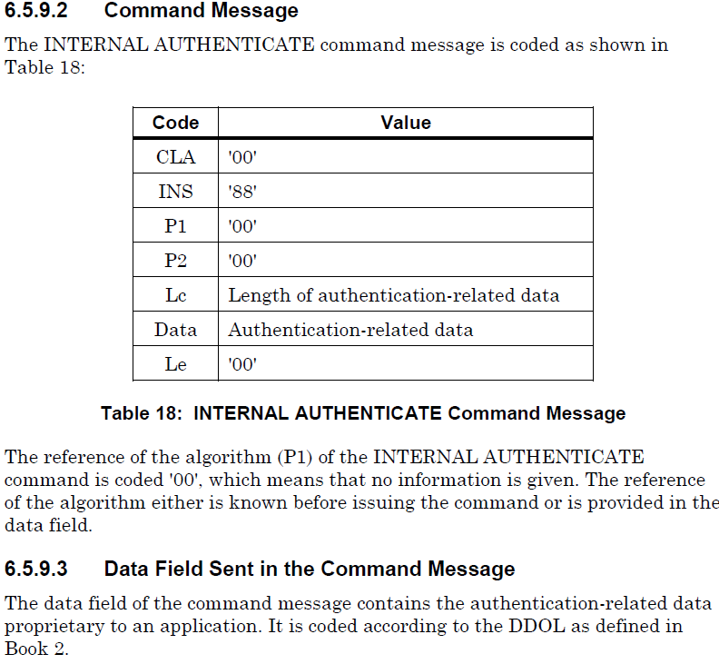
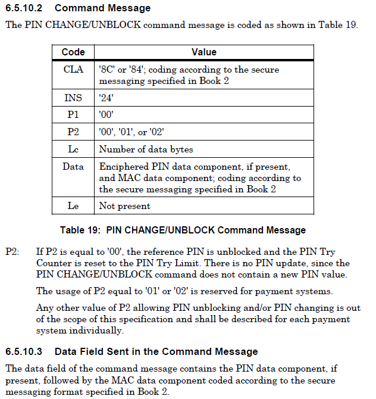

# Table of Contents
- [terms](#terms)
- [commands](#commands)
- [structures](#structures)

 
 

# terms
<b>AID</b> – APPLICATION IDENTIFIER  
<b>AFL</b> – APPLICATION FILE LOCATOR  
<b>APDU</b> – APPLICATION PROTOCOL DATA UNIT  
<b>ATR</b>  - ANSWER TO RESET  
<b>BER</b> – BASIC ENCODING RULES  
<b>CDO</b>L – CARD RISK MANAGEMENT DATA OBJECT LIST  
<b>CVM</b> – CARD VERIFICATION METHOD  
<b>DF </b>– DEDICATED FILE  
<b>DOL</b> – DATA OBJECT LIST  
<b>ICC</b> – INTERGATED CIRCUIT CARD  
<b>CLA</b> – CLASS BYTE  
<b>INS</b> – INSTRUCTION BYTE  
<b>PAN</b> – PRIMARY ACCOUNT NUMBER  
<b>PDOL</b> – PROCESSING OPTION DATA OBJECT LIST  
<b>PSE</b> – PAYMENT SYSTEM ENVIRONMENT  
<b>PTS</b> – PROTOCOL TYPE SELECTION  
<b>Xx </b>– ANY VALUE  
<b>T=0</b> – CHARACTER PROTOCOL  
<b>T=1</b> – BLOCK PROTOCOL  

 
 

# commands
1) select file command.

 

2) read records command.

 

3) application unblock

 

4) external authenticate

 

5) generate AC  
<b>The GENERATE AC command sends transaction-related data to the ICC, which computes and returns a cryptogram.</b>

 

6) get challenge

 

7) get data

 

8) get processing options

 

9) internal authenticate

 

10) pin change or unblock

 

11) verify

 
 

# structures

 

 

